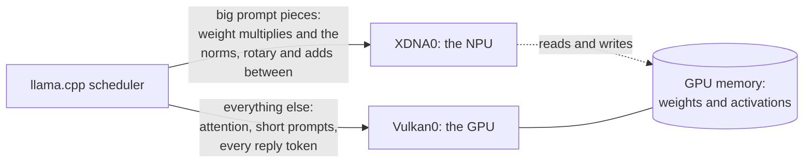

# llama-xdna-hybrid

This fork adds Linux builds and containers to
[Cyronius/ggml-xdna](https://github.com/Cyronius/ggml-xdna). It uses unmodified,
pinned llama.cpp b10944 with a compiled XDNA backend. Eligible prefill
operations run on the NPU; attention, the KV cache and decoding stay on Vulkan.

Linux support is experimental. See [Linux setup and validation](docs/Linux.md)
and [current verification state](.agents/STATUS.md). A successful build is not
a hardware performance result. Linux releases use `linux-v*` tags; the upstream
Windows instructions below remain available.

---

# ggml-xdna: llama.cpp prompt reading on the AMD Ryzen AI NPU

ggml-xdna is an add-on for llama.cpp that reads prompts on the NPU of an
AMD Ryzen AI 300 laptop, next to the integrated GPU. It loads into an
unmodified llama.cpp Windows build. The GPU keeps doing everything else,
including writing the reply.

## Requirements

- Windows 11
- A Ryzen AI processor with an NPU. Only tested on Strix Point: the Ryzen AI
  9 HX 370 with Radeon 890M graphics. At start the add-on runs a small test
  multiply on the NPU and turns on only if it gets it right, so it decides
  by what the NPU does, not by the chip's name (see
  [Troubleshooting](#troubleshooting) if it turns itself off). Strix Halo
  (Ryzen AI Max) and Krackan Point (Ryzen AI 7 350, Ryzen AI 5 340) have the
  same NPU as Strix Point and should pass, but nobody has run it on one
  yet. Strix Halo's GPU is much bigger, so there the GPU may be faster on
  its own.
- The AMD NPU driver. Tested with 32.0.20102.3930.
- A GPU driver with Vulkan. Tested with Radeon driver 32.0.31041.1004.
- llama.cpp release **b10944**, Windows Vulkan build
  (`llama-b10944-bin-win-vulkan-x64.zip`). The add-on is built against that
  release and must run with it.

## Quick start

Download `ggml-xdna-<version>-llama-b10944-win-x64.zip` from the
[releases page](https://github.com/Cyronius/ggml-xdna/releases) and unzip it
into a folder of its own. It's llama.cpp's own Windows Vulkan release
(b10944), unmodified, with the add-on (`ggml-xdna.dll`), its NPU kernel
(`bfp16_gemm.xclbin`) and the launcher (`npu.exe`) next to it.

The zip isn't signed, so Windows may warn the first time you run something
from it ("Windows protected your PC": click "More info", then "Run
anyway"). To check the download, compare the zip's SHA-256 with the
`.sha256` file next to it on the releases page; `SHA256SUMS.txt` inside the
zip lists every file's.

Open a terminal in that folder and put `npu` in front of the llama.cpp
command:

```
npu llama-server
npu llama-cli -m model.gguf
```

With no model given, `npu` lists the models it finds and asks which one:

```
Models found:
   0  all of them: llama-server's router, which loads each model when it's asked for
   1  granite-4.1-3b-Q4_K_S                 2.0 GB  LM Studio: unsloth
   2  Qwen3.8-27B-UD-IQ3_S                 12.0 GB  LM Studio: unsloth
   3  gpt-oss-20b-MXFP4                    12.1 GB  Hugging Face: ggml-org
Pick a number (Enter: granite-4.1-3b-Q4_K_S; q: quit):
```

It looks in a `models` folder next to `npu.exe`, LM Studio's models folder,
llama.cpp's download folder and the Hugging Face download folder. Enter
picks the model you chose last time. "All of them" (llama-server only)
serves every model in the list and loads each when a request names it.

What `npu` does for you:
- points llama.cpp at the add-on next to it;
- checks the NPU can run, and if so adds `-dev XDNA0,Vulkan0 -ts 0,1`
  (`-ts 0,1`: none of the model's layers belong to the NPU; see below). If
  it can't, it adds nothing, says why in one line, and llama.cpp runs on
  the GPU;
- adds `-ub 2048 -b 2048` for llama-server, llama-cli and llama-completion
  when the NPU is on, so prompts reach it in bigger pieces (faster, see
  below). You can pass `-ub 512` to keep llama.cpp's default, but then the
  NPU sits out unless you also pass `--min-chunk 512` (below).

Anything you give yourself (`-m`, `-dev`, `-ts`, `-ub`, `-b`) is kept, and the
rest of your command reaches llama.cpp exactly as typed. If you give `-dev`
yourself, `npu` adds none of the above, so pass `-ts 0,1` too. `npu server` works
for `npu llama-server` too. Put the folder on your `PATH` to run `npu` from
anywhere.

`npu`'s own options go before the program's name:

```
npu --memory-gb 20 llama-server -m model.gguf
```

`--memory-gb` is the most memory the NPU's copies of the weights may take,
in GB (`0.5` works; `0` keeps the NPU out). Without it, the limit is the
memory free once the model is loaded, less 4 GB or a tenth of the machine's
memory, whichever is larger, and at most 20 GB (see Limitations). Layers
that don't fit stay on the GPU.

`--min-chunk` is the smallest piece of a prompt, in tokens, the NPU takes.
The default is 1,024: smaller pieces go to the GPU, which read them faster
in our tests. `npu --min-chunk 512 llama-bench ...` puts llama.cpp's
default 512-token chunks on the NPU too.

`npu -h` lists the options.

**Without the launcher,** set `GGML_BACKEND_PATH` to the add-on and name
the NPU yourself:

```
set GGML_BACKEND_PATH=C:\path\to\llama-b10944\ggml-xdna.dll
llama-server -m model.gguf -dev XDNA0,Vulkan0 -ts 0,1
```

Without `-dev XDNA0,...`, llama.cpp runs as if the add-on weren't there.

`-ts 0,1` keeps every layer on the GPU, which is where llama.cpp puts them
anyway. Without it, llama.cpp's automatic memory fitting crashes while
loading a mixture-of-experts model (a divide by zero in its layer search).
With it, llama.cpp prints one harmless line at load:
`failed to fit params to free device memory: model_params::tensor_split
already set by user, abort`. It still fits the context size.

## The NPU's power mode

The NPU has a power setting of its own, separate from Windows'. AMD
recommends "Performance" for language models. In our tests it made no
difference to the add-on: switching between "Default" and "Performance"
every few minutes for 24 rounds, the add-on read Qwen3-1.7B's prompts at
the same speed in both (median 1.00x, half the rounds within 3%).

To change it, open a terminal as administrator (Start, type `cmd`, then
"Run as administrator") and run:

```
C:\Windows\System32\AMD\xrt-smi.exe configure --pmode performance
```

`xrt-smi` comes with the NPU driver. It isn't on the `PATH`, so give its
full path. To check the setting:

```
C:\Windows\System32\AMD\xrt-smi.exe examine -r platform
```

It shows `Power Mode : Performance`. To go back:

```
C:\Windows\System32\AMD\xrt-smi.exe configure --pmode default
```

- It applies to everything that uses the NPU, not just llama.cpp, and it
  uses more power. We haven't measured how much.
- In our tests it went back to "Default" after a restart, so check it with
  the `examine` command after restarting.
- `--pmode turbo` also exists. It needs the charger plugged in (otherwise it
  acts as `performance`). We haven't measured it.

## Results

Prompt reading speed with the add-on, against the GPU alone, both reading in
2,048-token chunks (what `npu` uses). Ryzen AI 9 HX 370, measured 2026-10-05.
Each figure is the median of the per-round ratios, with the slowest and
fastest round in brackets.

| model | quant | width | GPU alone, tokens/s | with the add-on | rounds |
|---|---|---|---|---|---|
| Qwen3.8-27B | UD-IQ3_S | 5,120 | 48 | **1.88x** (1.82–1.90) | 3 |
| LFM2.5 2.6B | Q8_0 | 2,048 | 899 | **1.46x** (1.36–1.55) | 9 |
| Qwen3-4B | Q4_K_M | 2,560 | 492 | **1.33x** (1.32–1.35) | 3 |
| LFM2.5 1.2B | Q8_0 | 2,048 | 1,986 | **1.31x** (1.25–1.34) | 9 |
| Granite 4.1 3B | Q4_K_S | 2,560 | 648 | **1.30x** (1.29–1.40) | 9 |
| Gemma 4 E4B | UD-Q4_K_XL | 2,560 | 356 | 1.01x (0.98–1.03) | 3 |
| Qwen3-1.7B | Q4_0 | 2,048 | 1,599 | 0.97x (0.91–0.99) | 9 |
| LFM2.5 8B-A1B | UD-Q4_K_S | 2,048 | 1,050 | 0.97x (0.96–1.01) | 3 |
| Ornith 35B (Qwen3.6 35B-A3B) | APEX-I-Mini | 2,048 | 207 | 0.92x (0.91–0.92) | 3 |
| LFM2.5-350M | Q8_0 | 1,024 | 6,137 | 0.89x (0.88–0.91) | 3 |
| Qwen2.5-1.5B | Q4_0 | 1,536 | 1,793 | 0.77x (0.76–0.87) | 3 |

What the spread of results says:

- **Most models gain, and the biggest gains are on the biggest model.**
  Qwen3.8-27B nearly doubles, and it does that with only 49 of its 65 layers
  on the NPU, because the memory limit holds the rest back.
- **Mixture-of-experts models lose.** Both of them, in every round. The NPU
  can't run the expert step, so it only gets the attention and shared
  weights, and that costs more in hand-overs than it saves. The add-on warns
  and runs them anyway.
- **Models narrower than 2,048 lose.** Those two are the slowest results
  here. The add-on warns about them too.
- **Gemma 4 only breaks even** because its GeGLU isn't implemented on the NPU
  side yet, so those blocks split to the GPU.
- **4-bit models gain least.** The NPU converts every weight to its own 8-bit
  copy whatever the file holds, so its speed doesn't depend on the quant,
  while the GPU reads the original weights every prompt and so gets most of
  the benefit of a small one. This is not about precision: the 3-bit model is
  the best result here, because llama.cpp's GPU kernel for that quant is
  slower than its well-tuned 4-bit ones.
- **Don't read these to two decimal places.** On models below about 3B a
  measurement takes seconds, and the ratio moved 8–14% from round to round
  however many rounds we ran. A second sitting on four of those models
  disagreed with the first by up to 14%. The larger models held to within
  1–5% *within a sitting*, but not from one day to the next: the NPU tends
  to settle at one of two speeds about 25% apart and stay there for a while.
  Qwen3-4B read 1.33x in every round on 2026-10-05 and 1.41–1.63x the next
  day; the table keeps the lower figure. Any single row may be either draw.
- **The NPU's power mode made no difference.** Switching it back and forth
  within one run (24 rounds) gave the add-on 1.00x its "Default" speed on
  "Performance".
- **Long prompts gain less, but aren't slower.** A 32,768-token prompt took
  99 s with the add-on against 102 s on the GPU alone for Qwen3-1.7B, and
  278 s against 301 s for Qwen3-4B (one run each, 2026-10-06). Attention
  runs on the GPU either way, and the longer the prompt the bigger its share
  of the work, so the gain shrinks toward even.
- **Smaller chunks are slower.** At llama.cpp's default 512-token chunks the
  add-on was slower than the GPU (median 0.80–0.87x over 20+ runs), which is
  why it takes only chunks of 1,024 tokens or more unless told otherwise
  (`npu --min-chunk`).

**How it was measured:** one `llama-bench` process per round tests both
devices (`-dev Vulkan0,XDNA0/Vulkan0 -p 2048 -n 0 -ub 2048 -b 2048 -r 3`), so
the model is loaded once and the two measurements sit next to each other in
time. Each round's ratio compares that pair, and the table reports the median
of the rounds. The machine was otherwise idle and its processor and GPU load
was logged every five seconds throughout; note that such a log counts the
benchmark's own work, so the steadiness of the rounds within a model is the
better evidence that nothing else interfered. Compare only paired, repeated
runs like these: on this machine a single run proves little.

**To measure your own models:** `bench.ps1` runs the same paired
measurement and prints a row of this table for each model you give it. It's
in `tools\` in the repo and next to `npu.exe` in the release zip.

```
powershell -ExecutionPolicy Bypass -File bench.ps1 -Model C:\models\Qwen3-4B-Q4_K_M.gguf
```

`-Rounds 9` for models under about 3B. `-Kl -Text <a long text file>` also
measures how far the answers drift from the GPU's, as in the Accuracy table.

## Accuracy

The NPU works in 8-bit blocks, so its results differ from the GPU's by
rounding. Measured with `llama-perplexity --kl-divergence` against the GPU
alone. "Same top token" is how often both pick the same most likely next
token. The reply column compares a 32-token greedy reply to a prompt of about
3,700 tokens from llama.cpp's documentation.

| model | mean KL divergence | same top token | reply |
|---|---|---|---|
| Qwen3-1.7B, Qwen3-4B, Qwen2.5-1.5B | 0.004–0.008 | about 95% | usually word for word |
| LFM2.5 1.2B Q8_0 | 0.0034 | 96.7% | word for word |
| Gemma 4 E4B UD-Q4_K_XL | 0.0043 | 97.8% | the same up to token 18 |
| LFM2.5 2.6B Q8_0 | 0.0045 | 96.7% | word for word |
| Granite 4.1 3B Q4_K_S | 0.0073 | 96.1% | word for word |
| Ornith 35B (mixture of experts) | 0.011 | 95.7% | word for word |
| LFM2.5 8B-A1B (mixture of experts) | 0.020 | 93.4% | the same up to token 10 |
| Qwen3.8-27B UD-IQ3_S | not measured | | the GPU's reply |

- **Every dense model stays under 0.01**, about as close as the GPU is to
  itself across llama.cpp builds. In the server tests on Qwen3-1.7B, the
  replies that differed split at a near-tie between two likely words
  ("--model-name" against "--model_name").
- **Mixture-of-experts models drift further.** Most likely the 8-bit rounding
  of each layer's router step, which picks the experts a token goes to, now
  and then picks differently. The add-on warns about these models (see
  Limitations).
- **Qwen3.8-27B was checked at the default memory limit** (49 of its 65
  layers on the NPU). Past about 26 GB of weight copies the NPU's memory gets
  damaged; the add-on catches that rather than answering wrongly (see
  Limitations).
- **KL depends on the text it's measured over,** so don't expect your
  figures to match these to the digit. `bench.ps1 -Kl` over 40,000
  characters of llama.cpp's own docs gave 0.0047 (96.0% same top token) for
  Qwen3-1.7B and 0.031 (92.2%) for LFM2.5 8B-A1B, against the table's
  0.004–0.008 and 0.020. The picture is the same: dense models well under
  0.01, mixture-of-experts models over it.

The same holds with llama-server's parallel slots, cached conversations,
contexts of 32,768 tokens, and two models served at once by its router.

## Limitations

- **Windows only.** Linux is planned for later.
- **Only tested on Strix Point.** Other Ryzen AI chips whose NPU passes the
  test at start are let in, untested.
- **Prompt reading only.** Replies are written one token at a time, and that
  stays on the GPU.
- **Pieces under 1,024 tokens stay on the GPU**, so short prompts don't use
  the NPU. `npu --min-chunk` changes that.
- **Narrow models are slower on the NPU.** Both models we tested with a width
  (embedding size) under 2,048 read prompts more slowly with the add-on than
  without it: 0.77x at width 1,536 and 0.89x at width 1,024 (see Results).
  Width 2,048 and up gain. Roughly, the losing bracket is models under about
  1.5 billion parameters. The add-on doesn't turn them away: if you start it,
  it runs, and it says this once on the first prompt:

  ```
  xdna: narrow model (width 1536): the GPU alone was faster than the NPU on
  every model this size we tested. Running it on the NPU as asked
  ```

  For those models, use the GPU alone (`-dev Vulkan0`, or llama.cpp without
  `npu`).
- **Memory:** the NPU keeps its own 8-bit copy of each weight it uses,
  about 1.1 GB per billion parameters, on top of llama.cpp's. It's built
  in the background while the model loads, which takes a few seconds (4.4 s
  for Qwen3-4B). llama-server is usually ready before the first request; a
  prompt given on the command line waits for the rest.
  The copies are kept within the memory free once the model is loaded, less
  4 GB or a tenth of the machine's memory, whichever is larger, and at most
  20 GB. When they don't all fit, the first layers that do go to the NPU
  and the rest stay on the GPU, and the add-on says so:
  `xdna: NPU weight copies limited to 20.0 GB (...): the first 49 layers on
  the NPU, the rest on the GPU`. `npu --memory-gb` (or
  `GGML_XDNA_MAX_COPY_GB`) sets the limit.
- **The NPU holds only so much.** On our 88 GB machine, once the NPU's
  memory passes 26 GB, some of it comes back damaged, with no error. That
  limit is the NPU's own: what the GPU uses doesn't change it. That's why
  the default stops at 20 GB. If you
  raise it with `--memory-gb` and that happens, the add-on notices the
  broken results, says so in one line, and hands the work to the CPU and
  GPU: the answer stays right, but the rest of that prompt runs on the CPU.
  On a big model that takes many minutes (22 instead of 1 for Qwen3.8-27B
  in our test). Later prompts run on the GPU at its usual speed.
- **Mixture-of-experts models are a poor fit.** The NPU can't run the expert
  step, so only the attention and shared weights move to it. Their answers
  also drifted further from the GPU's than any dense model's in our tests
  (LFM2.5 8B-A1B and gpt-oss-20b reached a KL of 0.020 and 0.037 against the
  0.01 we hold dense models to), most likely because rounding each layer's
  router multiply to 8 bits changes which experts a token uses. The add-on
  runs them anyway and says this once on the first prompt:

  ```
  xdna: mixture-of-experts model: the NPU cannot take the expert step, so it
  gets only part of the work, and in our tests these models' answers drifted
  further from the GPU's than any dense model's. Running it on the NPU as
  asked; -dev Vulkan0 would use the GPU alone
  ```

- **A few other layers stay on the GPU:** variants the NPU side doesn't
  implement yet (bias adds, some rotary settings). Output is still correct;
  less of the work moves.
- If the NPU fails during a run, the add-on finishes that step on the CPU
  and hands everything to the GPU from then on. The rest of that prompt is
  slow.

## How it works



The add-on registers a device, XDNA0, that shares the GPU's memory. llama.cpp
keeps every weight in GPU memory as usual, so work can move between the two
without copies. The add-on accepts only large prompt work: a model's weight
multiplies on pieces of 1,024 tokens or more, and the small steps between
them, so each hand-over covers most of a transformer block.

On the NPU, one kernel program serves every model: the add-on makes the NPU
instructions for each matrix size itself, so there's nothing to build per
model. The kernel works in bfp16, blocks of eight 8-bit values sharing one
exponent. Each weight is converted once, on first use. While the NPU runs one
part of the prompt, the CPU prepares the next.

## Troubleshooting

When the NPU can't run, `npu` says why and runs llama.cpp on the GPU:

```
npu: running on the GPU only: <reason>
```

Without the launcher, the add-on offers no XDNA0 device and logs
`xdna: not offering XDNA0: <reason>`. A command that names
`-dev XDNA0,Vulkan0` itself then stops with `invalid device: XDNA0`; use
`npu`, or `-dev Vulkan0`, until the reason is fixed.

| reason | what to do |
|---|---|
| no bfp16_gemm.xclbin next to ggml-xdna.dll | copy it there, or set `GGML_XDNA_KERNELS` to it |
| GGML_XDNA_KERNELS=... names no xclbin | fix the path |
| no NPU driver (xrt_coreutil.dll not found) | install the AMD NPU driver |
| the NPU driver's xrt_coreutil.dll lacks a function this backend uses | the driver is older or newer than the add-on was built for; report it |
| no NPU found (...) | the driver doesn't see an NPU |
| the NPU won't load ... | another program may be holding the whole NPU, or this NPU can't take the add-on's program |
| the NPU "..." couldn't run a test multiply (...) | this NPU can't run the add-on's program; report it with your chip |
| the NPU "..." got a test multiply wrong (...) | this NPU runs the add-on's program wrong; report it with your chip |
| the add-on didn't load | `ggml-xdna.dll` isn't next to `npu.exe`, or `GGML_BACKEND_PATH` points elsewhere |

**Is it doing anything?** `npu` prints `npu: prompts on the NPU` when it
turns it on. `set GGML_XDNA_TRACE=1` prints where the time goes every few
hundred multiplies. A prompt under 1,024 tokens never reaches the NPU
(`npu --min-chunk` changes that).

**Slower than the Results table?** Speeds vary from run to run on the same
machine, because the processor, GPU and NPU share one chip and its power
budget. Compare medians of several runs, not single runs.

**Reporting a problem:** open an issue with your chip, the NPU and GPU driver
versions, the model, the command, and the output with `GGML_XDNA_TRACE=1`.

## Settings

All optional, and none needed with `npu`. They're environment variables
(`set GGML_XDNA_TRACE=1` in cmd, `$env:GGML_XDNA_TRACE = "1"` in
PowerShell), read once when llama.cpp starts: set them before starting it.
An empty value counts as unset.

| variable | default | |
|---|---|---|
| `GGML_XDNA_KERNELS` | `bfp16_gemm.xclbin` next to the DLL | another xclbin |
| `GGML_XDNA_MIN_BATCH` | 1024 | the smallest piece of a prompt, in tokens, the NPU takes (`npu --min-chunk` sets it) |
| `GGML_XDNA_MIN_MFLOP` | 256 | the smallest multiply the NPU takes, in millions of operations |
| `GGML_XDNA_COPY_AT_LOAD` | 1 | 0 builds the NPU's weight copies during the first prompt instead of while the model loads |
| `GGML_XDNA_MAX_COPY_GB` | memory free at load, less 4 GB or a tenth of memory, at most 20 | the most memory, in GB, the NPU's weight copies may take; 0 keeps the NPU out (`npu --memory-gb` sets it) |
| `GGML_XDNA_BLOCKS` | 1 | 0 takes only the multiplies, not the steps between them |
| `GGML_XDNA_STREAMS` | 2 | how many parts a piece is split into, so the CPU and NPU overlap |
| `GGML_XDNA_N_THREADS` | all cores | CPU threads for the add-on's own work |
| `GGML_XDNA_TRACE` | 0 | 1 prints where the time goes |
| `GGML_XDNA_PINNED` | 1 | 0 reads from the GPU into ordinary memory instead of pinned memory: slower, for software Vulkan devices |
| `GGML_XDNA_HOST_ONLY` | 0 | 1 runs the NPU's share on the CPU instead: for tests without an NPU |

## Building from source

Needs Visual Studio 2022 or its Build Tools, with the C++ tools (they bring
CMake and Ninja). Then, from the repository:

```
build.cmd
```

It downloads llama.cpp b10944 and its matching headers into `third_party\`,
builds the add-on and its tests, copies the DLL, the kernel and `npu.exe`
next to the llama.cpp binaries in `third_party\llama-b10944`, and runs the
tests. Run `npu` from there as in [Quick start](#quick-start). The NPU tests run only where the NPU
driver is installed; the others need a Vulkan GPU. `build.cmd notest` skips
the tests.

The build needs no NPU driver: the list of driver functions the add-on uses
is in [vendor/xrt-implib](vendor/xrt-implib/xrt_coreutil.def).
`tools\check-xrt-driver.ps1` checks an installed driver against it.

The NPU kernel ships prebuilt
([kernels/bfp16_gemm/prebuilt](kernels/bfp16_gemm/prebuilt)). Rebuilding it
needs AMD's IRON toolchain; see [kernels/bfp16_gemm/build.ps1](kernels/bfp16_gemm/build.ps1).

What the add-on must do, and how each part is checked, is in
[specs/xdna-backend/spec.md](specs/xdna-backend/spec.md).

## License

MIT ([LICENSE](LICENSE)). The vendored XRT headers and the NPU kernel keep
their own licenses; see [NOTICE](NOTICE).
